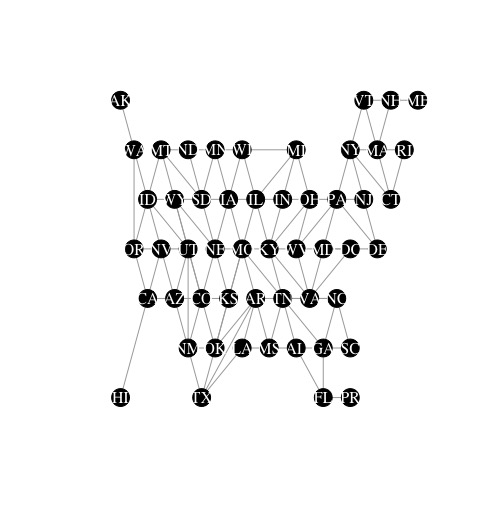

```{r setup, include=FALSE}
library(flexdashboard)
library(shiny)
library(ggplot2)
library(dplyr)
library(kableExtra)
library(compensator)
library(DT)
library(shinyWidgets)


```


Compensation Tool 
=======================================================================


Row
-----------------------------------------------------------------------

### Welcome to the Nonprofit CEO Compensation Appraisal Tool! 


Please enter the following information then click submit. 


```{r}
# Input State 
selectInput(inputId = "input.org.state",
            label = "State",
            choices = state.abb52)

# Input Location
selectInput(inputId = "input.org.location",
            label = "Location Type",
            choices = c("Metropolitan", "Rural"))

# Input Total Expenses
numericInput(inputId = "input.org.expense", 
             label = "Total Annual Expenses", 
             value = 1000000, 
             min = 1e5,
             max = 1e10)

# NTEE Input
textInput(inputId = "input.org.ntee",
          label = "NTEE Code",
          value = "A24")

# Generate Report 

actionButton(inputId = "generate",
             label = "Generate Appraisal")

appraisal <- eventReactive(input$generate, {
  
  loc <- dplyr::case_when(input$input.org.location == "Metropolitan" ~ "metro",
                          input$input.org.location == "Rural" ~ "rural")
  
  org <- compensator::get_org_values(state = input$input.org.state,
                                     location.type = loc,
                                     total.expense = input$input.org.expense,
                                      ntee = input$input.org.ntee)
  

  search.criteria <-
  list(broad.category = org$broad.category,
       major.group = base::LETTERS,
       tens = 0:9,
       type.org = org$type.org,
       univ = org$univ,
       hosp = org$hosp,
       location.type = org$location.type,
       state = state.abb52,
       total.expense = c(0.1*org$total.expense, 10*org$total.expense) )
  
  samp <- select_sample(org = org, search.criteria = search.criteria)
  predict_salary(samp)
  
  })

renderPrint({
  # print(appraisal()[[2]])
  app <- appraisal()
  print(paste0("Your suggested salary is ", dollarize(round(app[[2]][1], 0)), " - ", dollarize(round(app[[2]][2],0)), "."))
  })


```


Detailed Appraisal
=======================================================================

### Recent Downlads

```{r}
mtcars %>%
  kable()
```


About
=======================================================================


Here is we will put the about information 


## Geo dist map

```{r picture, echo = F, fig.cap = "Map used for calculating geographic distance between two states", out.width = '100%'}

```


Gender Pay Gaps
=======================================================================

Inputs {.sidebar}
-------------------------------------

**Filter By Location:**

```{r}
#### Inputs for Graph 

## State
shinyWidgets::pickerInput(
   inputId = "filter.gender.state",
   label = "States",
   choices = state.abb52,
   multiple = TRUE,
   selected = state.abb52,
   options = list(
     `actions-box` = TRUE,
     `deselect-all-text` = "None",
     `select-all-text` = "Select All",
     `none-selected-text` = "NA"
   )
)

## Location Type
shinyWidgets::pickerInput(
   inputId = "filter.gender.location.type",
   label = "Location Type",
   choices = c("Metropolitan" = "metro",
               "Rural" = "rural"),
   multiple = TRUE,
   selected = c("Metropolitan", "Rural"),
   options = list(
     `actions-box` = TRUE,
     `deselect-all-text` = "None",
     `select-all-text` = "Select All",
     `none-selected-text` = "NA"
   )
)


```


**Filter By Organization Characteristics: **

```{r}
## Broad Category
shinyWidgets::pickerInput(
  inputId = "filter.gender.broad.category",
  label = "Broad Category",
  choices = c("Arts, Culture, and Humanities" = 1,
              "Education" = 2,
              "Environment and Animals" = 3,
              "Health" = 4,
              "Human Services" = 5,
              "International, Foreign Affairs" = 6,
              "Public, Societal Benefit" = 7,
              "Religion Related" = 8,
              "Mutual/Membership Benefit" = 9,
              "Unknown/Unclassified"= 10,
              "University" = 11,
              "Hospital" = 12), #showing up as 1:10 and idk why
  multiple = TRUE,
  selected = 1:12,
  options = list(
    `actions-box` = TRUE,
    `deselect-all-text` = "None",
    `select-all-text` = "Select All",
      `none-selected-text` = "NA"
    )
  )


## Total Expenses
numericRangeInput("filter.gender.total.expense", 
                  "Range of Total Expenses",
                  value = c(0, Inf), #can we get commas on these values?
                  min = 0
)

## Total Employees
numericRangeInput("filter.gender.total.employee", 
                  "Range of Total Employees",
                  value = c(0, Inf), #can we get commas on these values?
                  min = 0)
```


Column
------------------------------------------------------------------

Here is where we will put the graphs

```{r}

#Format the Search Criteria
gender.graph.filters <- reactive({
  filter.gender.1 <- list(form.year = 2019, #input$filter.year, 
                   state = input$filter.gender.state,
                   broad.categroy = input$filter.gender.broad.category,
                   location.type = input$filter.gender.location.type,
                   ntee = NA, #need to add input for this
                   ntee.cc = NA, #need to add input for this
                   total.expense = input$filter.gender.total.expense,
                   total.employee = input$filter.gender.total.employee)

  # Change null to na
  if(is.null(filter.gender.1$form.year)){filter.gender.1$form.year <- NA}
  if(is.null(filter.gender.1$state)){filter.gender.1$state <- NA}
  if(is.null(filter.gender.1$broad.category)){filter.gender.1$broad.category <- NA}
  if(is.null(filter.gender.1$location.type)){filter.gender.1$location.type <- NA}
  if(is.null(filter.gender.1$total.expense)){filter.gender.1$total.expense <- c(-Inf, Inf)}
  if(is.null(filter.gender.1$total.employee)){filter.gender.1$total.employee <- c(0, Inf)}

  filter.gender.1

})

# ## Testing that the filtering criteria is what it should be
# renderPrint({
#   paste(gender.graph.filters())
# })
```
